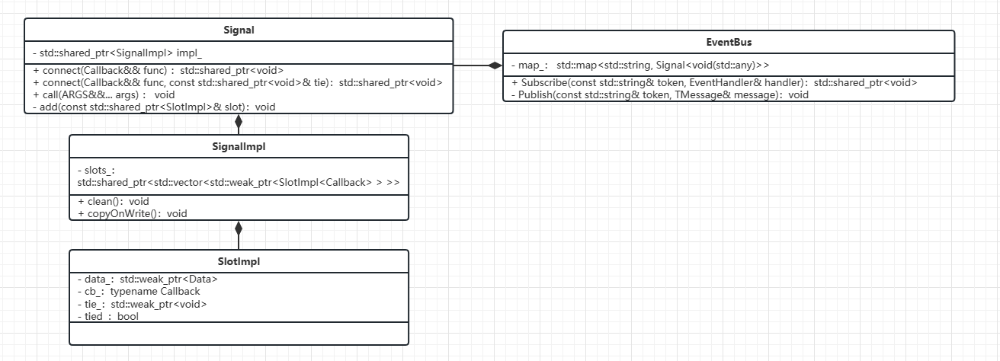

# EventBus
# 快速开始
```c++

// 事件定义
struct HelloEvent {
  int id;
  bool sex;
};

// 订阅，slot_为shared_ptr, 引用计数归0后，视为取消订阅。
slot_ = EventBus::GetInstance().Subscribe<std::shared_ptr<HelloEvent>>(
	"10086", [this](std::shared_ptr<HelloEvent> helloEvent) {
		// Qt
		qDebug() << "HelloEvent id: " << QString::number(helloEvent->id);
});

// 发布
QTimer::singleShot(1000, this, []() {
	QtConcurrent::run([]() {
		qDebug() << "Publish HelloEvent";
		auto helloEvent = std::make_shared<HelloEvent>();
		helloEvent->id = 666;
		helloEvent->sex = false;
		EventBus::GetInstance().Publish("10086", helloEvent);
	});
});
```

# 简介
模仿安卓live-eventbus用法，封装[SignalSlot.h](https://github.com/chenshuo/recipes/blob/master/thread/SignalSlot.h)实现，使用cow，保证订阅者和发布者调用线程安全，但是不能保证lambda捕获的变量线程安全。

# UML图
